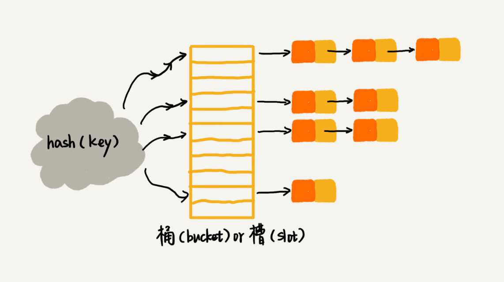

# 哈希表

哈希表这种数据结构十分重要，但是对于 JS 程序员来说不太好理解。因为它不是那么直观，而且也没有一个内置的哈希表类型。

众所周知，数组支持下标的随机访问，所以查找的时间复杂度为 O(1)，效率非常高。但是数组的插入和删除操作的平均时间复杂度为 O(n)，对于大量数据的插入和删除操作就显然就不够好了。所以我们希望能够有一种数据结构能实现 O(1) 的增删改查效率。于是伟大的哈希表便诞生了。

哈希表是数组的扩展，通过哈希函数将要存储的数据键值(key)转化为数组下标。所以可以认为哈希表等于数组加哈希函数。个人认为它是数据结构和算法的融合。

哈希表的不足之处

- 哈希表中的数据是无序的，所以不能以一种固定的方式遍历其中的元素
- 需要占用一些额外的存储空间

## 构造哈希函数

别人总结的构造哈希函数的基本要求：

- 哈希函数计算得到的哈希值(hashCode)是一个非负整数
- 如果 `key1 == key2`, 那么 `hash(key1) = hash(key2)`;
- 如果 `key1 != key2`, 那么 `hash(key1) != hash(key2)`

第二条说明哈希表中的 key 是不允许重复的，不能用相同的 key 存储不同的数据。

第三条看似合理，但真实情况下，几乎不可能找到一个不同的 key 对应的哈希值都不同的哈希函数。既然不可避免**哈希冲突**，那么就只有解决它。

优秀的哈希函数应该具有以下优点：

- 执行速度快，效率高
- 计算出的哈希值均匀分布

## 哈希冲突

哈希冲突不可避免，常用的解决冲突的方法有开放寻址法和链表法。

### 链表法 (Chaining)

链表法好理解，效率高。实际应用广，原理如图

### 开放寻址法 (Open addressing)

开放寻址法就是当遇到冲突的时候，选择空闲的槽位 (slot) 来存放冲突的数据项。探测空槽的方法主要有三种：

- 线性探测（Linear Probing）
- 二次探测（Quadratic probing）
- 再哈希法（Double hashing）

#### 线性探测

步长为1

#### 二次探测

步长为1，4， 9， 16

#### 再哈希法

用一个额外的哈希函数生成步长
